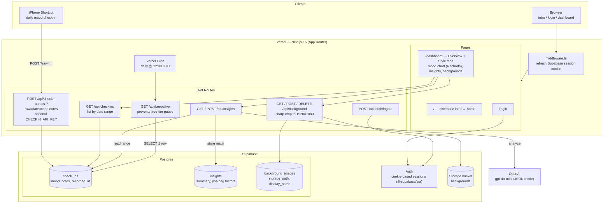

# Mental Health Check-in

Daily mood tracking via iPhone Shortcut, with a Next.js dashboard, Supabase persistence, and LLM-generated insights.

## Architecture

> Keep this diagram in sync: update it in the same PR as any architectural change.

*(README content to be rewritten.)*
