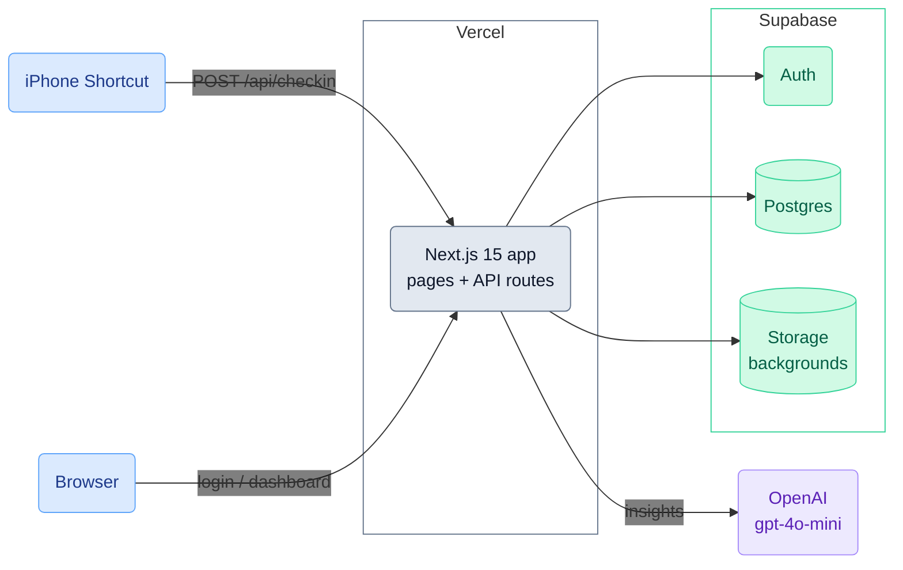
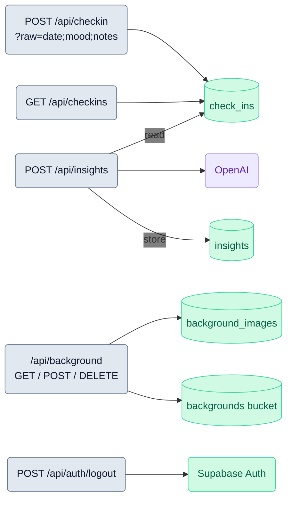

# Mental Health Check-in

Daily mood tracking via iPhone Shortcut, with a Next.js dashboard, Supabase persistence, and LLM-generated insights.

## Architecture

### System overview

### API routes → data

